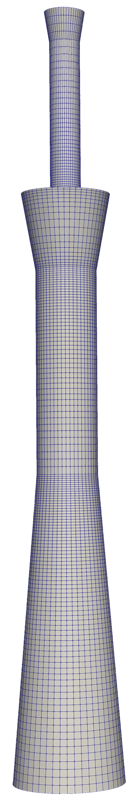
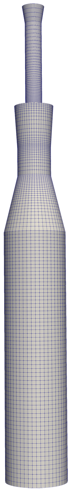
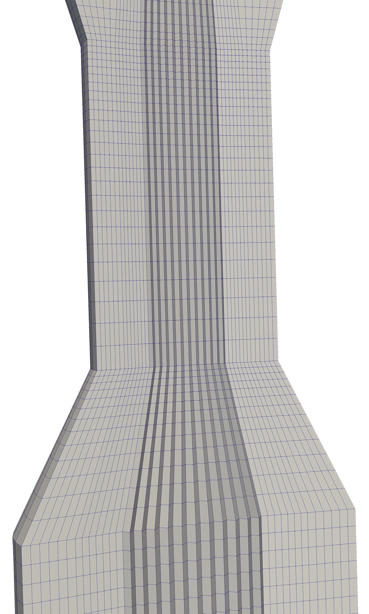

# Metall Vessel Script

### For easier creation of OpenFOAM's blockMesh dictionaries

> Warning! This project is currently under development and is not yet very user-friendly. It still lacks some important features and probably features a lot of bugs. However, you're welcome to suggest features, improvements, and point out bugs.

### What it is

blockMesh is a very powerful mesher but the amount of manual labour it requires to make even the simplest meshes makes it mostly useless.

This work is intended for faster generation of structured grids for metallurgical containers

### What you need
1. OpenFOAM blockMesh.
2. numpy.
3. scipy.
4. jinja2.
5. 3.9 ≥ python version ≥ 3.6; It is best not to exceed 3.9.
6. Linux ：Ubuntu 20.04 or other better; Windows : WSL or other virtual machine.
### Long Nozzle Example

##### Generate long nozzles of different shapes in seconds by simply changing the parameters